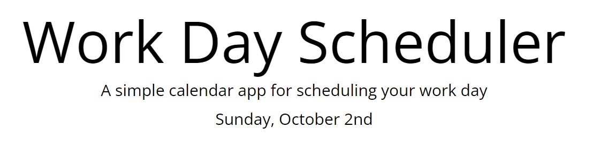
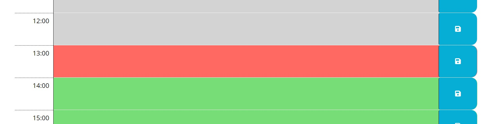
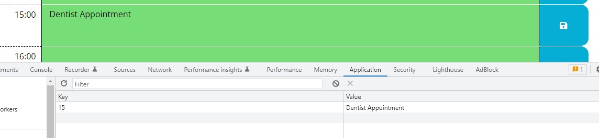

# Work Day Scheduler
## Repo for Challenge 5 - Create a Work Day Scheduler

### Decsription

This repo contains code for the the 5th challenge of the bootcamp. The challenge this week was to create a daily scheduler that can be used to organize daily tasks by the hour. Several of the topics we have been learning about that I included in this challenge are moment.js, jQuery, and bootstrap. The page uses moment.js to display the date and change the color of the row depending on the current hour. It uses jQuery to dynamically create the rows, and it uses bootstrap for the styling of the rows. The page also uses local storage to save user inputs so if the user leaves or refreshes the page, inputs to the text area are saved.

### Installation

N/A

### Usage

[Link to deployed website](https://mjkonkel.github.io/work-day-scheduler/)

>The application uses moment.js to display the current date at the top of the page.

>The screenshot below shows the past hours in gray, the current hour in red, and future hours in green.

>User inputs are saved in local storage.

### License

Please refer to the license in the repo.
